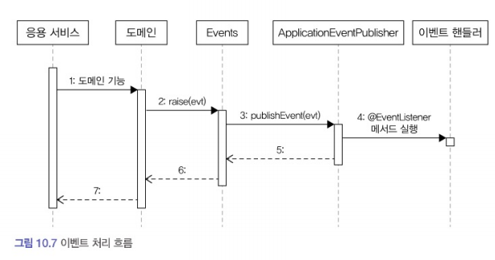

  

### 10.1 시스템 간 강결합 문제  
  
환불 처리를 진행하고자 할때 발생할 수 있는 시스템적 오류를 생각해보자.  
첫 번째로, **외부 서비스가 정상이 아닐 경우 트랜잭션 처리**를 어떻게 해야 할까? 환불 기능을 실행하는 과정에서 예외가 발생하면 트랜잭션을 롤백해야 할까? 커밋해야 할까?  
이 상황에서는 환불에 실패했으므로 주문 취소 트랜잭션을 롤백하는 것이 맞아 보인다. 하지만 반드시 이 방향이 맞는 것은 아니다. 주문은 취소 상태로 변경하고 환불만 나중에 다시 시도하는 방식으로 처리할 수 있다.  
두 번째 문제는 **성능**에 대한 것이다. 환불을 처리하는 외부 시스템의 응답 시간이 길어지면 그만큼 대기 시간도 길어진다. 환불 처리 기능이 30초가 걸리면 주문 취소는 그만큼 대기 시간이 증가하는 것이다.  
세 번째로 **도메인 객체에 서비스를 전달하면 추가로 설계상 문제**가 나타날 수 있다. 주문로직과 결제로직이 섞이는 문제이다.  
이 문제들이 발생하는 공통적인 이유는 주문 바운디드 컨텍스트와 결제 바운디드 컨텍스트 간의 강결합때문이다. 주문이 결제와 강하게 연결되어 있어 주문 바운디드 컨텍스트가 결제 바운디드 컨텍스트에 영향을 받게 되는 것이다.  
이런 경합을 없애기 위해 우리는 이벤트를 사용할 수 있다. 특히 비동기 이벤트를 사용하면 두 시스템 간의 결합을 크게 낮출 수 있다.  
  


### 10.2 이벤트 개요  
  
이 절에서 사용하는 **이벤트라는 용어는 '과거에 벌어진 어떤 것'을 의미**한다. 개발에서는 이벤트는 발생하는 것에서 끝나는 게 아니라 그 이벤트에 반응해서 원하는 동작을 수행하는 기능까지 이어져야 한다.  
  
**<이벤트 관련 구성 요소>**  
도메인 모델에 이벤트를 도입하려면 이벤트, 이벤트 생성 주체, 이벤트 디스패처(퍼블리셔), 이벤트 핸들러(구독자)가 필요하다.  
도메인 모델에서 **이벤트 생성 주체**는 엔티티, 밸류, 도메인 서비스와 같은 도메인 객체다. 이 도메인 객체는 도메인 로직을 실행해서 상태과 바뀌면 관련 이벤트를 발생시킨다.  
**이벤트 핸들러**는 이벤트 생성 주체가 발생한 이벤트에 반응한다. 이때 이벤트 생성 주체와 이벤트 핸들러를 연결해주는 것이 **이벤트 디스패처**다. 이벤트 디스패처는 이벤트 생성과 처리를 동기나 비동기로 구현할 수 있다.  
  
**<이벤트 구성>**  
이벤트는 발생한 이벤트에 대한 정보를 담는다.  
1. 이벤트 종류 : 클래스 이름으로 이벤트 종류를 표현  
2. 이벤트 발생 시간  
3. 추가 데이터 : 주문번호, 신규 배송지 정보 등 이벤트와 관련된 정보  
  
**<이벤트 용도>**  
이벤트는 크게 두 가지 용도로 쓰이는데 첫 번째는 **트리거**이다. 그리고 두 번째 용도는 서로 다른 시스템 간의 **데이터 동기화**이다. 예를들어 배송지를 변경하면 외부 배송 서비스에 바뀐 배송 정보를 전송해야 한다. 이대 주문 도메인은 배송지 변경 이벤트를 발생시키고 이벤트 핸들러는 외부 배송지 정보를 동기화할 수 있다.  
  
**<이벤트 장점>**  
1. 이벤트를 사용하면 서로 다른 도메인 로직이 섞이는 것을 방지할 수 있다.  
2. 이벤트 핸들러를 사용하면 기능 확장도 용이하다. 구매 취소 시 환불과 함께 이메일로 취소 내용을 보내고 싶다면 이메일을 발송하는 핸들러를 구현하면 된다!  
  
  
  
### 10.3 이벤트, 핸들러, 디스패처 구현 (스프링 사용)  
  
- 이벤트 클래스 : 이벤트를 표현  
- 디스패처 : 스프링이 제공하는 ApplicationEventPublisher 이용  
- Events : 이벤트 발행을 위해 디스패처 사용  
- 이벤트 핸들러 : 이벤트를 수신해서 처리  
  
이벤트 자체를 위한 상위 타입은 존재하지 않으므로 원하는 클래스를 이벤트로 사용하면 된다. 단, 이벤트는 과거에 벌어진 사건을 의미하므로 이벤트 클래스의 이름을 결정할 때는 과거 시제를 사용해야 한다. 
이벤트 클래스에는 이벤트를 처리하는 데 필요한 최소한의 데이터만 포함해야 한다. 모든 클래스가 공통으로 갖는 프로퍼티가 존재한다면 관련 상위 클래스를 만들어도 된다.  
```java
// 공통 처리를 위한 상위 클래스  
public abstract class Event {
    private long timestamp;
    
    public Event() {
        this.timestampe = System.currentTimeMillis();
    }

    public long getTimestamp() {
        return timestamp;
    }
}

// 상위 클래스를 상속받은 이벤트 클래스
public class OrderCancleedEvent extends Event {
    private String orderNumber;
    
    public OrderCanceledEvent(String number) {
        super();
        this.orderNumber = number;
    }
    ...
}
```  
  
이벤트 발생을 위해 스프링이 제공하는 ApplicationEventPublisher를 사용하여 이벤트를 발생시키도록 구현해보겠다.
```java
public class Events {
    private static ApplicationEventPublisher publisher;

    static void setPublisher(ApplicationEventPublisher publisher) {
        Events.publisher = publisher;
    }

    //이벤트 발생
    public static void raise (Object event) {
        if(publisher != null) {
            publisher.publishEvent(event);
        }
    }
}
```  
  
이벤트 퍼블리셔를 전달하기 위해 스프링 설정이 필요하다.  
```java
@Configuration
public class EventsConfiguration {
    @Autowired
    private ApplicationContext context;

    // Events 클래스를 초기화
    @Bean
    public InitializingBean eventInitializer() {
        return () -> Events.setPublisher(context); //발생 시킨 이벤트를 전달 받음
    }
}
```  
  
이벤트를 발생시킬 코드는 Events.raise() 메서드를 사용한다.  
```java
public class Order {
    public void cancel() {
        this.state = OrderState.CANCELED;
        Events.raise(new OrderCancelEvent(number.getNumber()));
    }
}
```  
  
이벤트를 처리할 핸들러는 스프링이 제공하는 @EventListener를 사용해서 구현한다.  
```java
@Service
public class OrderCanceledEventHander {
    private RefundService service;

    public OrderCanceledEventHander(RefundService service) {
        this.service = service;
    }
    
    @EventListener(OrderCanceledEvent.class) 
    public void handle(OrderCanceledEvent event) {
        service.refund(event.getOrderNumber());
    }
}
```  
ApplicationEventpublisher#publishEvent() 메서드를 실행할 때, OrderCanceledEvent 탕비 객체를 전달하면, OrderCacanceledEvent.class 값을 갖는 @EventListener가 붙은 메서드를 찾아 실행한다.  
  
**응용 서비스와 동일한 트랜잭션 범위에서 이벤트 핸들러 실행**  
  


### 10.4 동기 이벤트 처리 문제  
  
이벤트를 사용하면 강결합 문제는 해소할 수 있지만 외부 서비스에 영향을 받는 문제는 해결하지 못 한다. 퍼블리셔에서 성능이 저하되면 이벤트 핸들러에서도 영향을 받아 성능이 저하되고, 트랜잭션 문제도 생길 수 있다. 그렇다면 예외가 발생했을 때, 메서드의 트랜잭션을 반드시 롤백해야할까? 외부 시스템과의 연동을 동기로 처리할 때 발생하는 성능과 트랜잭션 범위 문제를 해소하는 방법은 이벤트를 비동기로 처리하거나 이벤트와 트랜잭션을 연계하는 것이 있다.  
  
  

### 10.5 비동기 이벤트 처리  
  
우리가 구현해야 할 것 중에서 'A 하면 이어서 B 하라'는 내용을 담고 있는 요구사항은 실제로 'A 하면 최대 언제까지 B 하라'인 경우가 많다. 즉, 일정 시간 안에만 후속 조치를 처리하면 되는 경우가 많다. 이때 'A 하면'은 이벤트로 볼 수 있고, 'B 하라'는 이벤트를 처리하는 핸들러에서 보낼 수 있다.  
이벤트를 비동기로 구현할 수 있는 방법은 다양하지만 그 중에서 4 가지 방법으로 구현해 보겠다.  
1. 로컬 핸들러를 비동기로 실행하기  
2. 메시지 큐 사용하기  
3. 이벤트 저장소와 이벤트 포워더 사용하기  
4. 이벤트 저장소와 이벤트 제공 API 사용하기  
  
**<1. 로컬 핸들러 비동기 실행>**  
이벤트 핸들러를 비동기로 실행하는 방법은 스프링이 제공하는 @Async를 사용하여 별도로 이벤트 핸들러를 실행하는 것이다.  
```java
@SpringBootApplication
@EnableAsync // 스프링의 비동기 실행 기능 활성화
public class ShopApplication {
    public static void main(String[] args) {
        ...
    }
}

@Service
public class OrderCanceledEventHandler {
    @Async // 비동기로 실행할 이벤트 핸들러에 붙이기
    @EventListener(OrderCanceledEvent.class)
    public void hander(OrderCanceledEvent event) {
        refundservice.refund(event.getOrderNumber());
    }
}
```  
  
**<2. 메시징 시스템을 이용한 비동기 구현>**  
카프카나 래빗엠큐와 같은 메시징 시스템을 사용해서 비동기로 구현할 수 있다. 이벤트가 발생하면 이벤트 디스패처는 이벤트를 메시지 큐에 보낸다. 메시지 큐는 이벤트를 메시지 리스너에 전달하고 메시지 리스너는 알맞은 이벤트 핸들를 이용해 이벤트를 처리한다. 이때 이벤트를 메시지 큐에 저장하는 과정과 큐에서 이벤트를 읽어와 처리하는 과정은 별도 스레드나 프로세스로 처리된다.  
레빗MQ처럼 낳이 사용되는 메시징 시스템은 글로벌 트랜잭션 지원과 함께 클러스터와 고가용성을 지원하기 때문에 안정적으로 메시지를 전달할 수 있는 장점이 있다. 카프카는 글로벌 트랜잭션을 지원하지는 않지만 다른 메시징 시스템에 비해 높은 성능을 갖고있다.  
  
**<3. 이벤트 저장소를 이용한 비동기 처리>**  
이벤트가 발생하면 핸들러는 스토리지에 이벤트를 저장한다. 포워더(이벤트를 주기적으로 읽어와 전달)를 사용하는 방법이 있는데, 이것은 주기적으로 이벤트 저장소에서 이벤트를 가져와 이벤트 핸들러를 실행한다. 포워더는 별도 스레드를 이용하기 때문에 이벤트 발행과 처리가 비동기로 처리된다. 이 방식은 도메인과 이벤트 저장소가 동일한 DB를 사용한다. 즉 도메인의 상태 변화와 이벤트 저장이 로컬 트랜잭션으로 처리되는 것이다. 이벤트 처리에 실패할 경우 포워더는 다시 이벤트 저장소에서 이벤트를 읽어와 핸들러를 실행한다.  
이벤트 저장소를 이용하는 두 번째 방법은 외부 API를 사용하는 것이다. 이 둘의 차이점은 이벤트 전달 방식에 있다. 포워더 방식은 포워더를 이용해 이벤트를 외부에 전달했다. 반면 API 방식은 외부 핸들러가 API 서버를 통해 이벤트 목록을 가져간다. 그리고 API 방식은 이벤트 목록을 요구하는 핸들러가 자신이 어디까지 이벤트를 처리했는지 기억해야 한다.  
  
구현 코드  
```java
//이벤트 저장소에 보관할 데이터
public class EventEntry {
    private Long id; //식별 아이디
    private String type; //이벤트 타입
    private String contentType; //직렬화 데이터 형식
    private String payload; //이벤트 데이터
    private Long timestamp; //이벤트 시간
}

//EventStrore 인터페이스
//이벤트를 저장하고 조회,이벤트 객체를 json으로 직렬화 payload에 저장. 
public interface EventStore{
    void save(Object event);
    List<EventEntry> get(Long offset, Long limit);
}

//JdbcEventStore
@Component
public class JdbcEventStore implements Eventstore {
    private ObjectMapper mapper;
    private JdbcTemplate template;
    ...
    @Override
    ...
}

//이벤트를 저장소에 보관
@Component
public class EventStoreHandler {
    private EventStore eventStore;

    @EventListener(Event.class)
    public void handle(Event event){
        eventStore.save(event); //이벤트 객체 저장
    }
}
```  
이벤트는 과거에 벌어진 사건이므로 데이터가 변경되지 않는다. 이런 이유로 EventStore 인터페이스는 새로운 이벤트를 추가하는 기능과 조회하는 기능만 제공하고 기존 이벤트 데이터를 수정하는 기능은 제공하지 않는다.  
  
eventApi: rest api를 이용해 이벤트 목록 제공  
REST API 구현(eventApi: rest api를 이용해 이벤트 목록 제공)  
```java
//offset과 limi의 웹 요청 파라미터를 이용해 eventstore의 get을 실행하고 그 결과를 json으로 리턴
@RestController
public class EventApi {
    private EventStore eventStore;

    @GetMapping("api/events")
    public List<EventEntry> list (
        @RequestParam("offset") Long offset,
        @ReuqestParam("limit") Long limit
    ) {
        return eventStore.get(offset, limit);
    }
}
```  
API를 사용하는 경우 클라이언트는일정 간격으로 다음과 같은 과정을 실행한다.  
1. 가장 마지막에 처리한 데이터의 offset인 lastOffset을 구하고 없으면 0을 사용한다.  
2. 마지막에 처리한 lastOffset을 offset을 사용해서 API를 실행한다.  
3. API 결과를 받은 데이터를 처리한다.  
4. offset + 데이터 개수를 lastOffset으로 저장한다. (중복 처리 방지)  
  
  
포워더 구현  
-일정 주기로 이벤트를 읽어 이벤트 핸들러에 전달할 것.  
-api 방식과 비슷하게 마지막으로 처리한 이벤트의 offset부터  
```java
@Component
public class EventForwarder {
    private static final int DEFAULT_LIMIT_SIZE = 100;
    private EventStore eventStore;
    private OffsetStore offsetStore;
    private EventSender eventSender;
    private int limitSize = DEFAULT_LIMIT_SIZE;

    @Scheduled(initialDelay = 1000L, fixedDelay = 1000L)
    public void getAndSend() {
        long nextOffset = getNextOffset(); //읽어올 다음 offset 구하기
        List<EventEntry> events = eventStore.get(nextOffset, limitSize); //offset부터 limitSize만큼 이벤트를 구한다
        if(!events.isEmpty()) {
            int processedCount = sendEvent(event); //이벤트 전송
            if(processCound> 0) {
                saveNextOffset(nextOffset + processedCount);
            }
        }
    }

    private long getNextOffset() {
        return offsetStore.get();
    }

    private int sendEvent(List<EventEntry> events) {
        int processdedCount = 0;
        try {
            for (EventEntry entry : events) {
                eventSender.send(entry);
                processedCount++;
            }
        } catch(Exception e) {
            //로깅 처리
        }
        return processedCount; //처리한 이벤트 개수 
    }

    private void saveNextOffset(long nextOffset) {
        offsetStore.update(nextOffset);
    }
}
```  
  


### 10.6 이벤트 적용 시 추가 고려 사항  
  
1. 이벤트 소스를 EventEntry에 추가할지 여부  
2. 포워더에서 전송 실패를 허용할 범위 설정  
3. 이벤트 손실  
4. 이벤트 순서  
5. 이벤트 재처리  
  
**멱등성**  
연산을 여러 번 적용해도 결과가 달라지지 않는 성질.  
이벤트 처리에서도 같은 상태가 되도록 핸들러를 구현할 수 있다. 이벤트 핸들러가 이와같이 멱등성을 가지면 시스템 장애로 인해 같은 이벤트가 중복해서 발생해도 결과적으로 동일 상태가 된다. 이는 이벤트 중복 발생이나 중복 처리에 대한 부담을 줄여준다.  
  
