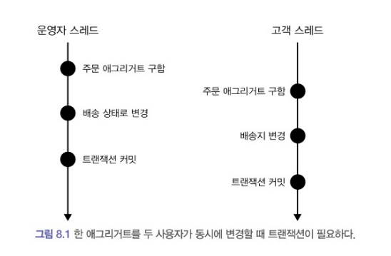
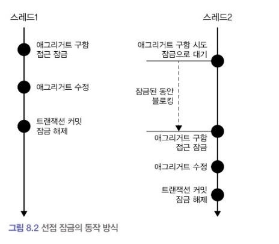

  

### 8.1 애그리거트와 트랜잭션  
  
  
  
위의 그림은 운영자와 고객이 동시에 한 주문 애그리거트를 생성하는 과정을 보여준다. 두 입장에서는 개념적으로는 동일한 애그리거트를 사용하지만, **물리적으로는 다른 애그리거트 객체를 사용**한다. 따라서 서로 영향을 주지 않는다.  
  
고객 스레드 입장에서는 주문 애그리거트 객체가 아직 배송 상태 전이라면 배송지 정보를 변경할 수 있다. 이 상황에서 두 스레드는 각각 트랜잭션을 커밋할 때, 수정한 내용을 DB에 반영한다. 이 순서가 운영자 스레드 입장에서 이미 기존 정보로 배송 상태를 변경할 때 나타난다면, **애그리거트의 일관성**이 깨지게 된다. 따라서 다음 두 가지 방법 중 하나를 택하여 문제가 발생하지 않도록 해야 한다.   
  
1. 운영자가 배송지 정보를 조회하고 상태를 변경하는 동안, 고객이 애그리거트를 수정하지 못하게 막는다.  
2. 운영자가 배송지 정보를 조회한 후에 고객에 정보를 변경한다면, 운영자가 애그리거트를 다시 조회한 후 수정하도록 한다.  
  
이 두 가지는 애그리거트 자체의 트랜잭션과 관련이 있다. DBMS가 지원하는 트랜잭션과 함께 애그리거트를 위한 추가적인 트랜잭션 처리 기법이 필요하다. 대표적으로 **선점잠금과 비선점 잠금**이 있다.  
  


### 8.2 선점 잠금  
  
**선점 잠금은 먼저 애그리거트를 구한 스레드가 사용이 끝날 때까지 다른 스레드가 해당 애그리거트를 수정하지 못하게 막는 방법**이다.  
  
위의 사진을 보면 스레드 2가 스레드 1의 사용이 끝날 때까지 블로킹된 것을 볼 수 있다. 스레드 1이 애그리거트를 수정하고 트랜잭션을 커밋하면 잠금이 해제된다. 이렇게 하면 한 애그리거트에 두 스레드가 동시에 수정할 수 없으므로 데이터 충돌 문제를 해소할 수 있다.  
선점 잠금은 보통 DBMS가 제공하는 행단위 잠금을 사용해서 구현한다. 오라클을 비롯한 다른 수의 DBMS가 for update와 같은 쿼리를 사용해 특정 레코드에 한 커넥션만 접근할 수 있는 잠금장치를 제공한다.  
JPA EntityManager에서는 LockModeType을 사용해 매핑된 테이블에서 선점 잠금 방식을 적용할 수 있다.  
```java
Order order = entityManger.find(
                Order.class, orderNumber, LockModeType.PESSIMISTIC_WRITE
);
```  
JPA 프로바이더와 DBMS에 따라 구현이 조금 다른데 hibernate를 사용하는 경우는 아래와 같이 구현한다. 
```java
public interface Repository extends<Member, MemberId> {
    @Lock(LockModeType.PESSIMISTIC_WRITE)
    @Query("SELECT m FROM m WHERE m.id = :id")
    Optional<Member> findByIdForUpdate(@Param("id) MemberId memberId);
}
```
  
**<선점 잠금과 교착 상태>**  
  
선점 잠금 기능을 사용할 때는 **잠금 순서에 따른 교착상태(deadlock)이 발생하지 않도록 주의**해야 한다. **교착 상태는 애그리거트에 대한 잠금이 이미 선점 되었을 때, 다른 스레드에서는 영원히 그 애그리거트에 대한 잠금 선점을 할 수 없는 상태**를 말한다.  
선점 잠금에 따른 교착 상태는 상대적으로 사용자 수가 많을 때 발생할 가능성이 높고, 사용자 수가 많아지면 교착 상태에 빠지는 스레드는 더 빠르게 증가한다. 더 많은 스레드가 교착 상태에 빠질 수록 시스템은 아무것도 할 수 없는 상황이 된다.  
이런 문제를 해결하기 위한 방법으로 **최대 대기 시간을 지정**하는 방법이 있다. JPA에서는 hint를 이용해 다음과 같이 구현할 수 있다.  
```java
Map<String, Object> hints = new HashMap<>();
hints.put("javax.persistenct.lock.timeout", 2000); //대기 시간 밀리초 단위로 설정
Order order = entityManager.find(
                Order.class, orderNumber, LockModeTpye.PESSIMISTIC_WIRTE, hints);
)
``` 
만약 지정한 대기 시간 이내에 잠금을 구하지 못하면, exception을 발생시킨다. DBMS에 따라 힌트가 적용되지 않을 수도 있기 때문에 사용 중인 DBMS가 관련 기능을 지원하는 지 확인해야 한다.  
```java
//JPA를 사용하는 경우 대기 시간 지정 형식 
public interface MemberRepository extens Repository<Member, MemberId> {
    @Lock(LockModeType.PESSIMISTIC_WRITE)
    @QueryHints({
        @QueryHint(name = "javax.persistenct.lock.timeout", value = "2000")
    })
    @Query("SELECT m FROM m WHERE m.id = :id")
    Optional<Member> findByIdForUpdate(@Param("id) MemberId memberId);
}
```