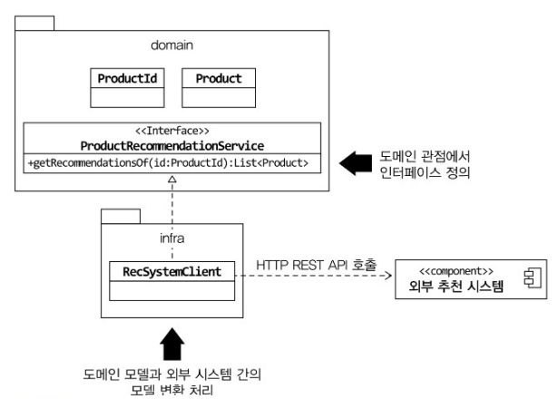

  

### 9.1 도메인 모델과 경계  
  
앞서 읽었듯이, 한 도메인은 여러 하위 도메인으로 구분 되기 때문에 완벽하게 단일 모델을 만드는 것은 올바르지 않다. 논리적으로 같은 존재처럼 보이지만 하위 도메인에 따라 다른 용어를 사용하는 경우도 있다. 예를 들어 시스템을 사용하는 사람을 회원 도메인에서는 '회원'이라고 부르지만, 주문 도메인에서는 '주문자'라고 불린다.  
이렇게 하위 도메인마다 사용하는 용어가 다르기 때문에 올바른 도메인 모델을 개발하기 위해 우리는 명확한 경계를 가진 하위 도메인마다 모델을 만들어야 한다. **모델은 특정한 문맥 하에 완전한 의미를 갖기 때문에 이렇게 구분되는 경계를 갖는 컨텍스트를 DDD에서는 바운디드 컨텍스트**라고 부른다.  
   
   
   
### 9.2 바운디드 컨텍스트  
  
**바운디드 컨텍스트는 용어의 기준으로 모델의 경계를 결정하며 한 개의 바운디드 컨텍스트는 논리적으로 한 개의 모델을 갖는다.**  
하지만 현실은 그렇지 않을 때가 많다. 바운디드 컨텍스는 **기업의 팀 조직 구조**에 따라 결정되기도 한다. 예를 들어, 주문 하위 도메인에 주문 바운디드 컨텍스트와 결제 금액 계산 바운디드 컨텍스트가 존재한다고 하면, 명확하게 용어를 구분하지 못해 두 하위 도메인을 하나의 바운디드 컨텍스트에서 구현할 때도 있다. 
<조직 구조에 따라 바운디드 컨텍스트가 결정되는 경우>  
  
  
위와 같은 상황에서 개발할 시에 **주의 점은 하위 도메인의 모델이 섞이지 않도록 하는 것**이다. 왜냐하면 하위 도메인 별로 기능을 확장하기 어렵고, 이는 서비스 경쟁력을 떨어뜨리는 원인이 되기 때문이다. 따라서 한 개의 바운디드 컨텍스트라고 해도 하위 도메인마다 구분되는 패키지를 갖도록 구현해야 한다.  
  

### 9.3 바운디드 컨텍스트 구현  
  
바운디드 컨텍스트는 도메인 모델 뿐만 아니라 사용자에게 필요한 표현 영역, 응용 서비스, 인프라스트럭처, db와 같이 도메인 기능을 제공하는 데 필요한 영역을 모두 포함한다. 모든 바운디드 컨텍스트를 반드시 도메인 주도로 개발할 필요는 없다.  
또한 바운디드 컨텍스트가 반드시 UI를 가지고 있어야 하는 것은 아니다. 예를 들어 상품 상세 보기 페이지를 구현할 때, 카탈로그와 리뷰 바운디드 컨텍스트에서 직접 벙보를 호출해 보여줄 수 있다. 혹은 브라우저와 바운디드 컨텍스트 사이에 UI를 처리하는 서버(프론트)를 두고 통신을 통해 사용자 요청을 처리하는 방법도 있다. 이 구조에서 UI서버는 각 바운디드 컨텍스트를 위한 파사드 역할을 수행한다.  
한 바운디드 컨텍스트에서 CRQS 패턴고 같이 여러 방식을 혼합해서 사용할 수도 있다. CQRS 패턴이란 명령 기능과 조회 기능을을 위한 모델을 구분하는 패턴이다. 이 패턴을 바운디드 컨텍스트에 적용하면, 상태 변경과 관련된 기능은 도메인 모델 기반으로 구현하고 조회 기능은 서비스-DAO를 이용해서 구현할 수 있다.  
각 바운디드 컨텍스트는 서로 다른 구현 기술을 사용할 수도 있다. 웹 MVC는 스프링 MVC를, 레포지터리 구현 기술로는 JPA를 사용할 수 있고, NETTY를 통해 REST API를 제공하고 MyBatis를 통해 리포지터리 구현 기술을 사용할 수 있다.  
  

### 9.4 마이크로 서비스와 바운드디드 컨텍스트  
  
하위 도메인에 기존 바운디드 컨텍스트를 위한 다른 컨텍스트가 존재할 때, 예를 들어 카탈로그 하위 도메인에 추천 바운디드 컨텍스트를 도입하는 경우가 있다, 개발을 하다보면 두 컨텍스트 간 통합이 필요할 때가 있다.  
마이크로 서비스의 특징은 바운디드 컨텍스트와 잘 어울린다. 각 바운디드 컨텍스트는 모델으 경계를 형성하기 때문에 바운디드 컨텍스트를 마이크로서비스로 구현하면 자연스럽게 컨텍스트별로 모델이 분리된다. 마이크로 서비스마다 하나의 프로젝트를 가지므로 코드 수준에서 모델을 분리해 두 바운드 컨텍스트 모델이 섞이지 않도록 해준다. 이렇게 별도 프로세스로 개발한 바운디드 컨텍스트는 독립적으로 배포하고 모니터링하며 확장하는데, 이 역시 마이크로서비스가 갖는 특징이다.  
  
  

### 9.5 바운디드 컨텍스트 간 관계  
  
바운디드 컨텍스트는 반드시 연결이 되기 때문에 두 바운디드 컨텍스트는 다양한 방법으로 관계를 맺는다. 가장 많이 사용되는 방법으 REST API와 같이 한쪽에서 API를 호출하는 것이다. 이때 API를 제공하는 쪽을 상류 컴포넌트, 제공 받는 쪽을 하류 컴포넌트라고 한다. 상류팀에 의존하는 하위 팀이 많을 경우, 이를 수용할 수 있는 API를 만들고 서비스 형태로 공개해서 서비스의 일관성을 유지할 수 있다. 이런 서비스를 공개 **호스트 서비스(open host service)**라고 한다.  
공개 호스트 서비스의 대표적인 예가 검색이다. 검색 시스템은 상류 컴포넌트이고, 블로그, 카페, 개시판 등이 하류컴포넌트가 된다. 상류 컴포넌트의 서비스는 상류 바운디드 컴텍스트의 도메인 모델을 따른다. 따라서 하류  컴포넌트는 상류 서비스의 모델이 자신의 도메인에 영향을 주지 않도록 완충 지대를 만들어야 한다.  
  
위의 그램에서 RecSystemClient는 **외부 시스템과의 연동을 처리하는데 외부 시스템이 내 도메인 모델을 침범하지 않도록 막아주는 안티코럽션 계층** 역할을 해준다.  
두 바운디드 컨텍스트가 같은 모델을 공유하는 경우도 있는데 이때 같은 모델을 **공유 커널**이라고 부른다. 공유 커널의 장점은 중복을 줄여준다는 것이다. 하지만 단점은 한 팀에서 임의로 모델을 변경할 수 없다는 점이다.  
마지막으로 **독립방식**이 있다. 서로 통합하지 않는 방식이다. 관계를 수동적으로 생성해야 하는데 규모가 커질수록 이에 대한 부담이 생기므로, 규모가 커졌다면 이 두 바운디드 컨텍스틑를 통합해주는 통합 시스템을 구현해야 할 수도 있다.   
  

### 9.6 컨텍스트 맵  
  
개별 바운디드 컨텍스트에 가려져 전체를 보지 못하는 경우를 방지하기 위해 전체 비즈니스를 조망할 수 있는 지도를 만든 것이 **컨텍스트 맵**이다. 작성하는 방법은 자유 방식이다. 간단한 도현과 선을 이용하고, 바운디드 컨텍스트 영역에 주요 애그리거트를 함께 표시해도 좋다. 오픈 호스트 서비스는 OHS로, 안티코럽션 계층은 ACL로 표시하면 이해도를 높일 수 있다. 그저 각 컨텍스트의 관계를 이해할 수 있는 수준에서 그리면 된다.  
컨텍스트 맵을 작성하면 하위 도메인과 일치하지 않는 바운디드 컨텍스트를 찾아 도메인에 맞게 바운디드 컨텍스트를 조절하고, 사업의 핵심 도메인을 위해 조직 역량을 어떤 바운디드 컨텍스트에 집중할지 파악하는 데 도움을 준다. 